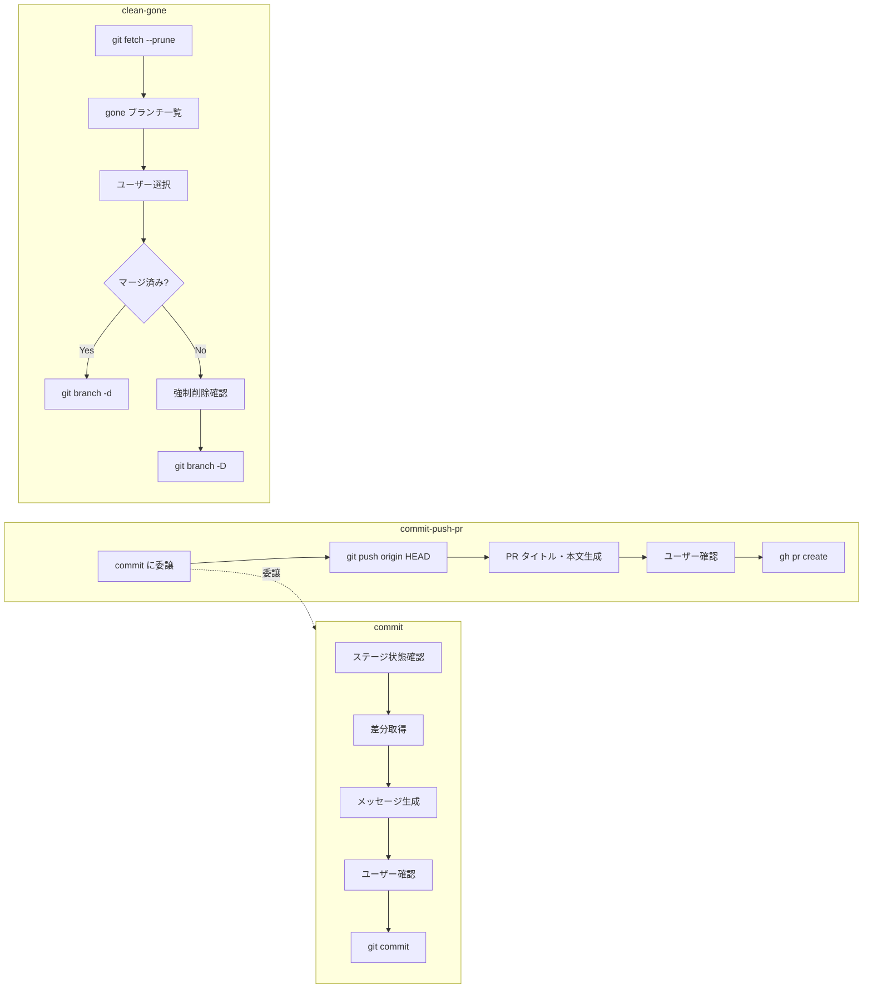

# create-commit

Conventional Commits 規約に従ったコミット作成・プッシュ・PR 作成・不要ブランチ整理を行うスキル集。

## Skills

### `commit`

ステージ済みの変更を Conventional Commits 形式のコミットメッセージで記録します。差分を解析して type / scope / subject / body を自動生成し、ユーザーが確認してからコミットします。

**トリガー例:** `コミットして`, `commit`, `変更をコミット`, `コミットメッセージを生成`

### `commit-push-pr`

コミット → プッシュ → PR 作成を一気通貫で実行します。`commit` スキルに委譲後、日本語の PR タイトル・本文を自動生成してユーザー確認を経てから `gh pr create` を実行します。

**トリガー例:** `コミットして PR を作って`, `commit push PR`, `push して PR を出して`, `変更をコミットしてプルリクを作りたい`

### `clean-gone`

リモートで削除済みのローカルブランチ（gone ブランチ）を一覧表示し、選択したブランチを削除します。マージ済みか否かを判定し、未マージブランチは強制削除前に追加確認を行います。

**トリガー例:** `gone ブランチを削除`, `不要なブランチを整理`, `リモートで削除されたブランチをクリーンアップ`

## Prerequisites

- `git` がインストール済みであること
- `gh` CLI がインストール済みであること（`commit-push-pr` スキル使用時）
- `gh auth login` で GitHub への認証が完了していること（`commit-push-pr` スキル使用時）

## Installation

```text
/plugin install create-commit@xeiculy-plugins
```

## How It Works


