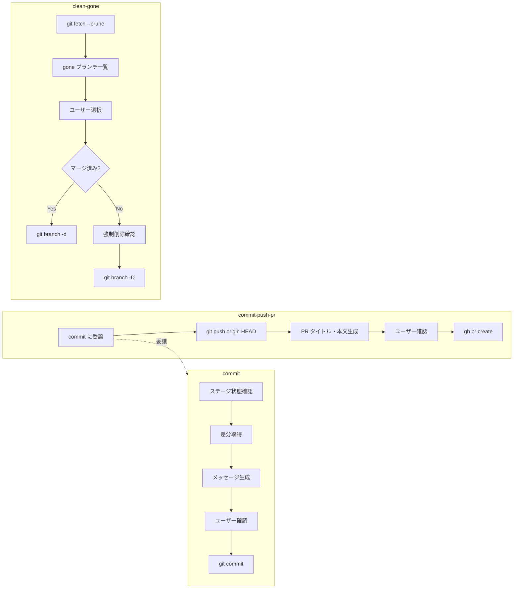

# create-commit

Conventional Commits 規約に従ったコミット作成・プッシュ・PR 作成・不要ブランチ整理を行うコマンド集。

## Commands

### `/create-commit:commit`

ステージ済みの変更を Conventional Commits 形式のコミットメッセージで記録します。差分を解析して type / scope / subject / body を自動生成し、ユーザーが確認してからコミットします。

### `/create-commit:commit-push-pr`

コミット → プッシュ → PR 作成を一気通貫で実行します。`/create-commit:commit` と同じコミット生成フローを実行後、日本語の PR タイトル・本文を自動生成してユーザー確認を経てから `gh pr create` を実行します。

### `/create-commit:clean-gone`

リモートで削除済みのローカルブランチ（gone ブランチ）を一覧表示し、選択したブランチを削除します。マージ済みか否かを判定し、未マージブランチは強制削除前に追加確認を行います。

## Prerequisites

- `git` がインストール済みであること
- `gh` CLI がインストール済みであること（`/create-commit:commit-push-pr` 使用時）
- `gh auth login` で GitHub への認証が完了していること（`/create-commit:commit-push-pr` 使用時）

## Installation

```text
/plugin install create-commit@xeiculy-plugins
```

## How It Works


```mermaid
flowchart LR
  subgraph commit["commit"]
    A[ステージ状態確認] --> B[差分取得] --> C[メッセージ生成] --> D[ユーザー確認] --> E[git commit]
  end

  subgraph cpp["commit-push-pr"]
    F[commit に委譲] --> G[git push origin HEAD] --> H[PR タイトル・本文生成] --> I[ユーザー確認] --> J[gh pr create]
  end

  subgraph cg["clean-gone"]
    K[git fetch --prune] --> L[gone ブランチ一覧] --> M[ユーザー選択] --> N{マージ済み?}
    N -->|Yes| O[git branch -d]
    N -->|No| P[強制削除確認] --> Q[git branch -D]
  end

  F -.->|委譲| commit
```
