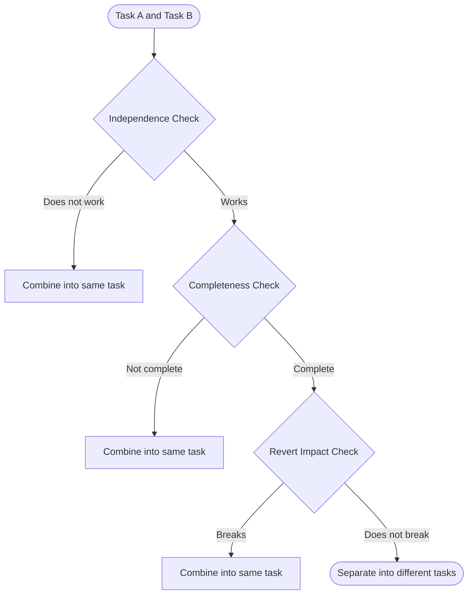

# Task Decomposition Guidelines

## Core Principle

Every task designed by AI should be "the smallest meaningful unit of change that can be independently reverted." Specifically, it must satisfy the following 4 conditions:

- Can be merged without breaking the application
- Includes both implementation and tests
- Can be reverted without affecting other tasks
- A reviewer can review it within 2–3 hours

---

## 3-Step Flowchart for Split Decisions

Use the following 3 steps to decide whether to combine Task A and Task B into one task or separate them. As soon as any step determines "high cohesion," combine them into one task. Only separate them into different tasks after passing all 3 steps.

### Step 1: Independence Check

"Does Task B work correctly without Task A?"

- **Does not work** → High cohesion: combine into the same task
- **Works** → Proceed to Step 2

Example: API endpoint and routing configuration → Does not work → Same task

### Step 2: Completeness Check

"Does Task A alone merge into a meaningful, complete feature?"

- **Not complete** → Combine into the same task
- **Complete** → Proceed to Step 3

Example: Email sending logic only → Meaningless without event trigger → Same task

### Step 3: Revert Impact Check

"If Task A is reverted, does Task B also break?"

- **Breaks** → Combine into the same task
- **Does not break** → Separate into different tasks

Example: Implementation code and test code → Reverting implementation breaks tests → Same task

---

## Quantitative Task Size Metrics

|           Metric            |    Ideal     | Maximum |
| :-------------------------: | :----------: | :-----: |
|        Files changed        |     3–10     |   15    |
| Lines changed (incl. tests) |   200–500    |  1,000  |
|      Test code volume       | 0.5x–2x impl |    -    |

If the cohesion of changes is high, do not force a split even if the size exceeds the guideline. Size is a supplementary metric only.

---

## Cohesion Pattern Catalog

### Always combine into the same task

- Implementation code ⇔ Test code (never merge implementation without tests)
- UI component ⇔ Tests for that component
- Store ⇔ Store tests
- Custom hooks / composables ⇔ Their tests

### Always separate into different tasks

- Refactoring ⇔ New feature addition (makes it easier to identify the cause of bugs)
- Each stage of a feature flag (implement → enable in tests → enable globally → remove)
- Dependency library updates ⇔ New feature additions
- Performance improvements ⇔ New feature additions
- Multiple features with no mutual dependencies

---

## 6 Perspectives for Evaluating a Task List

1. **Granularity check**: Is each task size appropriate? Are there any that are too large or too small?
2. **Cohesion check**: Are implementation and tests in the same task?
3. **Independence check**: Can each task be reverted independently? Does the app work correctly after merging?
4. **Dependency mapping**: Are dependencies between tasks clear? Are tasks that can be implemented in parallel identified?
5. **Improvement proposals**: If there are problems, specific recommendations on which tasks to split or consolidate
6. **Educational context check**: Does each task's `learning_context` give an implementer enough to write the first line of code?
   - `background` explains WHY this change is necessary (not just what it does)
   - `hints` answer "how do I write this?" — each hint includes a concrete code pattern or syntax example (1–3 lines), not abstract advice
   - `references` specify WHAT to look for, not just where (e.g., `src/stores/user.ts:15 — defineStore のアクション定義パターンを確認する`)
   - `references` include at least one external documentation link when the technology may be unfamiliar
   - `pre_implementation_checklist` contains 3–5 concrete items to verify before coding
