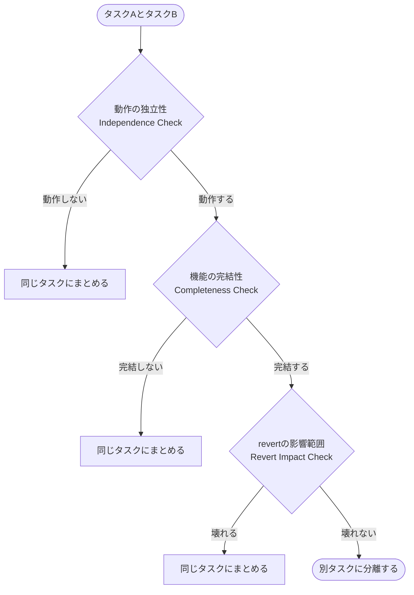

# タスク分解ガイドライン

## 基本原則

AIが設計するすべてのタスクは「**独立してrevertできる最小の意味ある変更単位**」であるべき。具体的には次の4条件を満たすこと。

- アプリケーションを壊さずにマージできること
- 実装とテストが含まれていること
- 他のタスクに影響を与えずにrevertできること
- レビュアーが2〜3時間以内にレビューできること

---

## 分割判断の3ステップフローチャート

タスクAとタスクBを同じタスクにまとめるか分けるかを、次の3ステップで判断する。どれか1つで「高凝集」と判断された時点で同じタスクにまとめ、3つすべてを通過してはじめて別タスクとして分離する。

### Step 1: 動作の独立性（Independence Check）

「タスクAがなくてもタスクBは正常に動作するか？」

- **動作しない** → 高凝集と判断し、同じタスクにまとめる
- **動作する** → Step 2へ進む

例: APIエンドポイントとルーティング設定 → 動作しない → 同じタスク

### Step 2: 機能の完結性（Completeness Check）

「タスクAだけをマージしても、意味のある機能として完結するか？」

- **完結しない** → 同じタスクにまとめる
- **完結する** → Step 3へ進む

例: メール送信ロジックのみ → イベントトリガーなしでは意味をなさない → 同じタスク

### Step 3: revertの影響範囲（Revert Impact Check）

「タスクAをrevertしたら、タスクBも壊れるか？」

- **壊れる** → 同じタスクにまとめる
- **壊れない** → 別タスクに分離する

例: 実装コードとテストコード → 実装をrevertするとテストが壊れる → 同じタスク

---

## タスクサイズの定量指標

|          指標          |       理想       |  最大   |
| :--------------------: | :--------------: | :-----: |
|     変更ファイル数     |     3〜10個      |  15個   |
| 変更行数（テスト含む） |    200〜500行    | 1,000行 |
|     テストコード量     | 実装の0.5倍〜2倍 |    -    |

凝集度が高い変更であれば、サイズが目安を超えても無理に分割しない。サイズはあくまで補助指標。

---

## 凝集度パターン集

### 常に同じタスクにまとめるべきもの

- 実装コード ⇔ テストコード（テストなしの実装はマージしない）
- UIコンポーネント ⇔ そのコンポーネントのテスト
- ストア ⇔ ストアのテスト
- カスタムフック・コンポーザブル ⇔ そのテスト

### 常に別タスクに分けるべきもの

- リファクタリング ⇔ 新機能追加（バグ発生時の原因特定を容易にする）
- feature flag の各段階（実装→テスト有効化→全体有効化→削除）
- 依存ライブラリの更新 ⇔ 新機能追加
- パフォーマンス改善 ⇔ 新機能追加
- 互いに依存しない複数の機能

---

## タスクリストを評価する5つの観点

1. **粒度チェック**: 各タスクのサイズが適切か、大きすぎる・小さすぎるものがないか
2. **凝集度チェック**: 実装とテストが同じタスクにあるか
3. **独立性チェック**: 各タスクを単独でrevertできるか、マージ後もアプリが正常動作するか
4. **依存関係マッピング**: タスク間の依存関係が明確か、並列実装できるタスクが識別されているか
5. **改善提案**: 問題があればどのタスクを分割・統合すべきかの具体的な推奨
